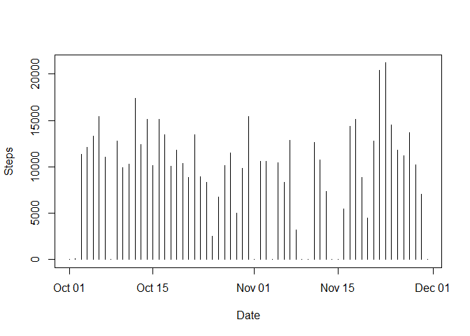
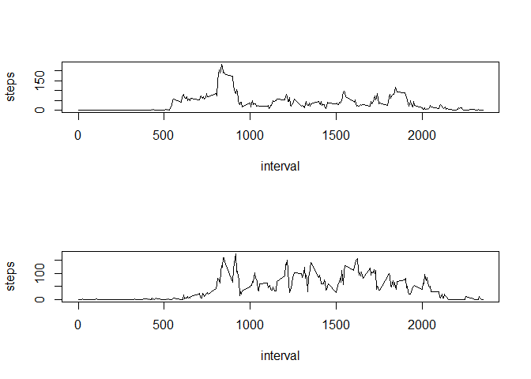

# Reproducible Research: Peer Assessment 1


## Loading and preprocessing the data

```r
dataFile <- unz(description = "activity.zip", filename = "activity.csv")
activityData <- read.table(file = dataFile, sep = ",", header = TRUE, na.strings = "NA")
activityData$date <- as.Date(activityData$date, format = "%Y-%m-%d")
## melt data for later use
library(reshape2)
actMelt <- melt(activityData, id = c("date", "interval"), measure.vars = c("steps"))
```

## What is mean total number of steps taken per day?


```r
dateSums <- dcast(actMelt, date ~ variable, sum, na.rm = TRUE)
plot(steps ~ date, data = dateSums, type = "h", ylab = "Steps", xlab = "Date")
```

 

```r
mean(xtabs(steps ~ date, data = activityData))
```

```
## [1] 10766.19
```

```r
mean(dateSums$steps, na.rm = TRUE)
```

```
## [1] 9354.23
```

```r
median(xtabs(steps ~ date, data = activityData))
```

```
## 2012-11-12 
##      10765
```

```r
median(xtabs(steps ~ date, data = activityData), na.rm = TRUE)
```

```
## [1] 10765
```

```r
median(dateSums$steps, na.rm = TRUE)
```

```
## [1] 10395
```

## What is the average daily activity pattern?

```r
intervalMeans <- dcast(actMelt, interval ~ variable, mean, na.rm = TRUE)
plot(steps ~ interval, data = intervalMeans, type = "l")
```

 

```r
max(intervalMeans$steps)
```

```
## [1] 206.1698
```

```r
intervalMeans[intervalMeans$steps == max(intervalMeans$steps),]
```

```
##     interval    steps
## 104      835 206.1698
```


## Imputing missing values

```r
sum(is.na(activityData$steps))
```

```
## [1] 2304
```

```r
newCol <- rep(floor(intervalMeans$steps), 61)
imputedData <- cbind(activityData, newCol)
imputedData$newCol[which(!is.na(imputedData$steps))] <- imputedData$steps[which(!is.na(imputedData$steps))]
library(reshape2)
impMelt <- melt(imputedData, id = c("date", "interval"), measure.vars = c("newCol"))
dateSums <- dcast(impMelt, date ~ variable, sum, na.rm = TRUE)
plot(newCol ~ date, data = dateSums, type = "h", ylab = "Steps", xlab = "Date")
```

 

```r
mean(xtabs(newCol ~ date, data = imputedData))
```

```
## [1] 10749.77
```

```r
mean(dateSums$newCol, na.rm = TRUE)
```

```
## [1] 10749.77
```

```r
median(xtabs(newCol ~ date, data = imputedData))
```

```
## 2012-11-09 
##      10641
```

```r
median(xtabs(newCol ~ date, data = imputedData), na.rm = TRUE)
```

```
## [1] 10641
```

```r
median(dateSums$newCol, na.rm = TRUE)
```

```
## [1] 10641
```
Using the floor function as step data should be in whole numbers

## Are there differences in activity patterns between weekdays and weekends?

```r
library(dplyr)
activityData <- mutate(activityData, days = factor(1*(weekdays(date) %in% c("Monday", "Tuesday", "Wednesday", "Thursday", "Friday")), labels = c("weekday", "weekend")))
actMelt <- melt(activityData, id = c("date", "interval", "days"), measure.vars = c("steps"))
intervalMeans <- dcast(actMelt, interval + days ~ variable, mean, na.rm = TRUE)
par(mfrow = c(2,1))
plot(steps ~ interval, data = intervalMeans[intervalMeans$days == "weekend",], type = "l")
plot(steps ~ interval, data = intervalMeans[intervalMeans$days == "weekday",], type = "l")
```

 

## exploratory scripting

head(activityData)
str(activityData)
xtabs(steps ~ date, data = activityData)
plot(xtabs(steps ~ date, data = activityData), type = "h", ylab = "Steps", xlab = "Date")
intervalMeans[activityData[is.na(activityData$steps),3]==intervalMeans$interval,2]
17568/288
[1] 61
newCol <- rep(floor(intervalMeans$steps), 61)
imputedData <- cbind(activityData, newCol)
