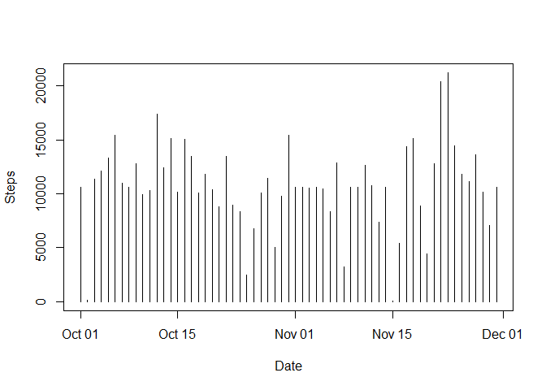
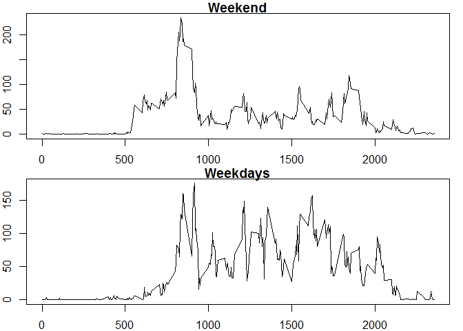

# Reproducible Research: Peer Assessment 1


## Loading and preprocessing the data 

Create a connection to the zip file. Use `read.table` to read in the data. Change date column from default of factors to a date format. Create a melt to make later calculations and plotting easier. Disable warnings so R versions aren't included in the md file on `library` command. 


```r
dataFile <- unz(description = "activity.zip", filename = "activity.csv")
activityData <- read.table(file = dataFile, sep = ",", header = TRUE, na.strings = "NA")
activityData$date <- as.Date(activityData$date, format = "%Y-%m-%d")
## melt data for later use
library(reshape2)
actMelt <- melt(activityData, id = c("date", "interval"), measure.vars = c("steps"))
```

## What is mean total number of steps taken per day?

Calculate the total number of steps taken per day


```r
xtabs(steps ~ date, data = activityData)
```

```
## date
## 2012-10-02 2012-10-03 2012-10-04 2012-10-05 2012-10-06 2012-10-07 
##        126      11352      12116      13294      15420      11015 
## 2012-10-09 2012-10-10 2012-10-11 2012-10-12 2012-10-13 2012-10-14 
##      12811       9900      10304      17382      12426      15098 
## 2012-10-15 2012-10-16 2012-10-17 2012-10-18 2012-10-19 2012-10-20 
##      10139      15084      13452      10056      11829      10395 
## 2012-10-21 2012-10-22 2012-10-23 2012-10-24 2012-10-25 2012-10-26 
##       8821      13460       8918       8355       2492       6778 
## 2012-10-27 2012-10-28 2012-10-29 2012-10-30 2012-10-31 2012-11-02 
##      10119      11458       5018       9819      15414      10600 
## 2012-11-03 2012-11-05 2012-11-06 2012-11-07 2012-11-08 2012-11-11 
##      10571      10439       8334      12883       3219      12608 
## 2012-11-12 2012-11-13 2012-11-15 2012-11-16 2012-11-17 2012-11-18 
##      10765       7336         41       5441      14339      15110 
## 2012-11-19 2012-11-20 2012-11-21 2012-11-22 2012-11-23 2012-11-24 
##       8841       4472      12787      20427      21194      14478 
## 2012-11-25 2012-11-26 2012-11-27 2012-11-28 2012-11-29 
##      11834      11162      13646      10183       7047
```

Make a histogram of the total number of steps taken each day


```r
dateSums <- dcast(actMelt, date ~ variable, sum, na.rm = TRUE)
plot(steps ~ date, data = dateSums, type = "h", ylab = "Steps", xlab = "Date")
```

 

Calculate and report the mean and median of the total number of steps taken per day 

Using xtabs rather than the melt as while the melt makes a better graph as it includes all days in the range including ones with no data, imputed zeroes in days with no data affects the averages. 

Mean:

```r
mean(xtabs(steps ~ date, data = activityData))
```

```
## [1] 10766.19
```

Median:

```r
median(xtabs(steps ~ date, data = activityData), na.rm = TRUE)
```

```
## [1] 10765
```

## What is the average daily activity pattern?

A time series plot (i.e. type = "l") of the 5-minute interval (x-axis) and the average number of steps taken, averaged across all days (y-axis). 

```r
intervalMeans <- dcast(actMelt, interval ~ variable, mean, na.rm = TRUE)
plot(steps ~ interval, data = intervalMeans, type = "l")
```

 

Which 5-minute interval, on average across all the days in the dataset, contains the maximum number of steps?

```r
intervalMeans[intervalMeans$steps == max(intervalMeans$steps),]
```

```
##     interval    steps
## 104      835 206.1698
```


## Imputing missing values

The total number of missing values in the dataset (i.e. the total number of rows with NAs)

```r
sum(is.na(activityData$steps))
```

```
## [1] 2304
```


A strategy for filling in all of the missing values in the dataset. The strategy does not need to be sophisticated. Taking the mean for each 5-minute interval and replacing `NAs` with a `floor()` function of that. Using the floor function as steps will always be round numbers. 

Create a new dataset that is equal to the original dataset but with the missing data filled in. 

```r
newCol <- rep(floor(intervalMeans$steps), 61)
imputedData <- cbind(activityData, newCol)
imputedData$newCol[which(!is.na(imputedData$steps))] <- imputedData$steps[which(!is.na(imputedData$steps))]
impMelt <- melt(imputedData, id = c("date", "interval"), measure.vars = c("newCol"))
intervalMeans <- dcast(impMelt, date ~ variable, sum, na.rm = TRUE)
```

Make a histogram of the total number of steps taken each day and Calculate and report the mean and median total number of steps taken per day. Do these values differ from the estimates from the first part of the assignment? What is the impact of imputing missing data on the estimates of the total daily number of steps?


```r
plot(newCol ~ date, data = intervalMeans, type = "h", ylab = "Steps", xlab = "Date")
```

 

Mean:

```r
mean(xtabs(newCol ~ date, data = imputedData))
```

```
## [1] 10749.77
```

Median:

```r
median(xtabs(newCol ~ date, data = imputedData), na.rm = TRUE)
```

```
## [1] 10641
```

The Mean and Median are both different from the estimates from the first part of the assignment. They have fallen after imputing missing data. There is less effect on the Mean as would be expected as mean interval estimates were used in imputing the missing data. Use of the floor function for imputing has imputed zeroes in intervals of low activity which may have had an affect on the Median estimates. 

## Are there differences in activity patterns between weekdays and weekends? 

Create a new factor variable in the dataset with two levels - "weekday" and "weekend" indicating whether a given date is a weekday or weekend day.

```r
library(dplyr)
activityData <- mutate(activityData, days = factor(1*(weekdays(date) %in% c("Monday", "Tuesday", "Wednesday", "Thursday", "Friday")), labels = c("weekday", "weekend")))
actMelt <- melt(activityData, id = c("date", "interval", "days"), measure.vars = c("steps"))
intervalMeans <- dcast(actMelt, interval + days ~ variable, mean, na.rm = TRUE)
```

Make a panel plot containing a time series plot (i.e. type = "l") of the 5-minute interval (x-axis) and the average number of steps taken, averaged across all weekday days or weekend days (y-axis).

```r
par(mfrow = c(2,1), mar = c(2,2,1,1))
plot(steps ~ interval, data = intervalMeans[intervalMeans$days == "weekend",], type = "l", main = "Weekend")
plot(steps ~ interval, data = intervalMeans[intervalMeans$days == "weekday",], type = "l", main = "Weekdays")
```

 

